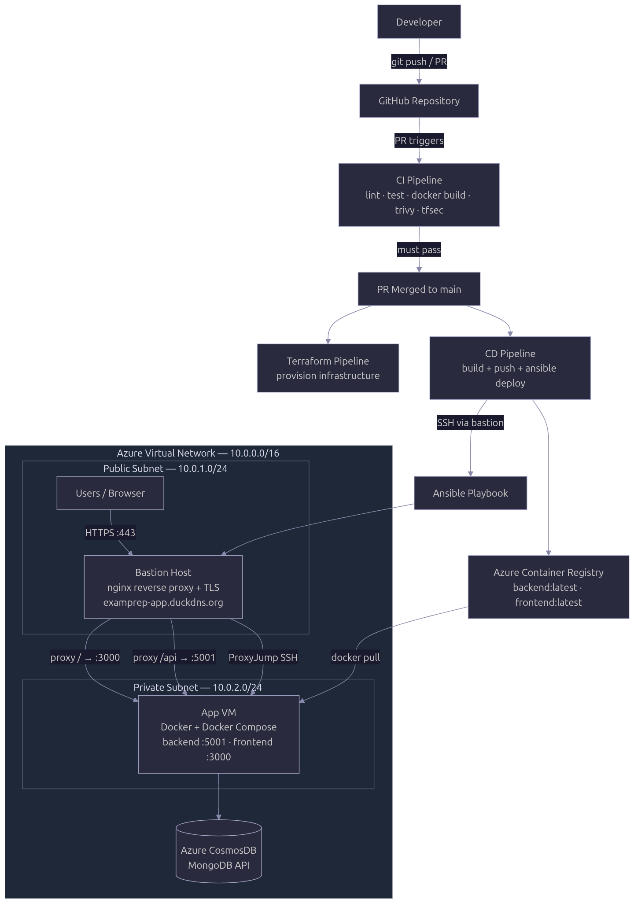
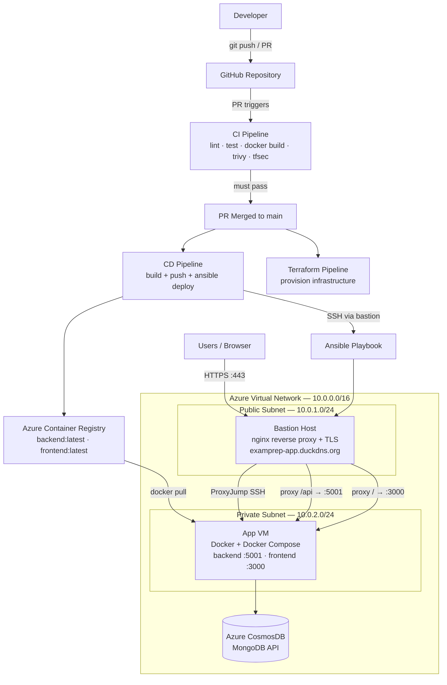

# Exam Prep

> A web-based platform helping African students excel in their examinations through interactive practice and instant feedback

## Live Application

**URL:** [https://examprep-app.duckdns.org](https://examprep-app.duckdns.org)

---

## African Context

Many students across Africa prepare for important national examinations at the end of secondary school and for university entrance exams. These exams are highly competitive and play a major role in determining students' academic and career opportunities.

However, access to structured and interactive revision materials remains limited in many areas. Students often depend on printed past questions, textbooks, or informal study groups. In some communities, access to quality digital learning platforms is still developing. As a result, many learners do not receive instant feedback on their performance and cannot easily track their progress over time.

This project aims to provide a simple, affordable, and accessible online platform where students can practice exam questions, receive immediate results, and monitor their improvement. By supporting digital learning and self-assessment, the platform helps improve exam preparation and educational outcomes across African countries.

## Team Members

| Name | Role | Student ID |
|------|------|------------|
| UWIMANA Chantal | Frontend · CI/Security | 755990021 |
| Desmond Tunyinko | Backend · Ansible / CD | 297697450 |
| Nmesoma Solomon Peter | Backend · Terraform / IaC | 764925507 |
| Sharangabo Edouard | Frontend · DevOps | [Student ID] |

## Project Overview

Exam Prep is a full-stack MERN (MongoDB, Express, React, Node.js) web application that allows students to practice exam questions online. Users can register, log in securely with JWT authentication, choose exam categories, attempt multiple-choice questions, and receive instant results with detailed feedback.

The system automatically calculates scores and shows correct answers with explanations. Students can also view their past attempts and monitor their improvement over time through personalized dashboards.

The platform includes an admin section where administrators can create exams, add questions, and manage content easily. The system is designed to be scalable, secure, and easy to maintain using modern development and DevOps practices, including GitHub Actions and Docker containerization.

### Target Users

Secondary school students

University students

People preparing for professional certification exams

Schools and training centers

### Core Features

- **User Registration and Authentication**: Secure account creation and login with JWT tokens and bcrypt password hashing
- **Password Reset**: Email-based password reset flow via Gmail SMTP — users receive a time-limited reset link

- **Practice Exams**: Users can choose from various exam categories and answer multiple-choice questions for any type of exam
- **Timed Practice Sessions**: Test yourself within specific time limits to simulate real exam conditions. The exam timer auto-submits when time runs out, with three countdown warnings (5 min, 2 min, 1 min) before expiry
- **Instant Results and Feedback**: Immediate scoring with correct answers and detailed explanations after submission
- **Performance Tracking**: View previous attempts and monitor improvement over time through personalized dashboards
- **Admin Dashboard**: Administrators can create and manage exams, add questions manually or fetch from external platforms via API integration
- **API Integration**: Fetch exam questions and content from external educational platforms and APIs to expand the question bank
- **Protected Routes**: Role-based access control for students and administrators
- **Responsive Design**: Seamless experience across desktop, tablet, and mobile devices
- **Dark / Light Mode**: User-controlled theme toggle, persisted in browser storage and applied globally across all pages
- **User Profile & Avatar**: Customisable display name and profile picture (base64 upload, up to 1 MB), with avatar shown in the navigation bar

## Architecture



**OR**



### Component Description

| Component | Location | Purpose |
|-----------|----------|---------|
| **GitHub Actions CI** | `.github/workflows/ci.yml` | Runs on every PR: lint, tests, Docker builds, Trivy + tfsec security scans. Blocks merges on failure. |
| **GitHub Actions CD** | `.github/workflows/cd.yml` | Runs on merge to main: re-runs CI, builds + pushes images to ACR, deploys via Ansible. |
| **Terraform Pipeline** | `.github/workflows/terraform.yml` | Validates IaC on PRs; TF Cloud applies on merge to main. |
| **Azure VNet** | `terraform/main.tf` | Isolated private network (10.0.0.0/16) containing all resources. |
| **Bastion Host** | Public subnet (10.0.1.0/24) | Only VM with a public IP. Serves as SSH jump host for Ansible and nginx reverse proxy for user traffic. |
| **App VM** | Private subnet (10.0.2.0/24) | No public IP. Runs Docker containers. Only reachable from the bastion. |
| **Azure Container Registry** | Managed Azure service | Stores Docker images built by CD. App VM pulls from here at deploy time. |
| **Azure CosmosDB** | Managed Azure service | MongoDB-compatible managed database. Replaces the local Docker MongoDB in production. |
| **Bastion NSG** | Public subnet | Allows SSH (22) and HTTP (80) from internet. SSH must be open to allow GitHub Actions runners (dynamic IPs). |
| **App NSG** | Private subnet | Allows SSH and app ports (80, 3000, 5001) only from the bastion subnet (10.0.1.0/24). |

## Technology Stack

| Layer           | Technology                                                        |
| --------------- | ----------------------------------------------------------------- |
| **Frontend**    | React 19, TypeScript, Vite 7, React Router 7, Axios               |
| **Backend**     | Node.js 24, Express 4, Mongoose 9                                 |
| **Database**    | MongoDB 6 (local dev) / Azure CosmosDB — MongoDB API (production) |
| **Auth**        | JWT (jsonwebtoken), bcryptjs, role-based access (student / admin) |
| **Testing**     | Jest 30, Supertest, MongoMemoryServer                             |
| **DevOps**      | Docker, Docker Compose, GitHub Actions CI/CD, Ansible             |
| **IaC**         | Terraform (Azure provider) — VNet, VMs, ACR, CosmosDB             |
| **Cloud**       | Azure (South Africa North) — VNet, Bastion, App VM, ACR, CosmosDB |
| **Security**    | Trivy (container scan), tfsec (IaC scan), NSG rules               |
| **Linting**     | ESLint 9, typescript-eslint                                       |

## Getting Started

### Prerequisites

**Docker setup (recommended):**

- Docker ≥ 20.10
- Docker Compose ≥ 2.0
- Git

**Manual setup:**

- Node.js ≥ 24
- npm ≥ 10
- MongoDB ≥ 6 (local) or a MongoDB Atlas account
- Git

---

### Quick Start with Docker Compose (Recommended)

1. **Clone the repository**

   ```bash
   git clone https://github.com/Darlington6/exam_prep.git
   cd exam_prep
   ```

2. **Create the backend environment file**

   ```bash
   cp backend/.env.example backend/.env
   ```

   Then edit `backend/.env`:

   ```dotenv
   PORT=5001
   MONGO_URI=mongodb://mongo:27017/exam_prep_db
   JWT_SECRET=your-super-secret-key-change-in-production
   JWT_EXPIRES_IN=7d

   # Optional — leave blank to use Ethereal (console preview) for password reset emails
   EMAIL_FROM=
   GMAIL_APP_PASSWORD=
   FRONTEND_URL=http://localhost:5173
   ```

   > **Note:** When running with Docker Compose the MongoDB host must be `mongo` (the service name), not `localhost`. Set `FRONTEND_URL=http://localhost:3000` (Docker) — not `5173` (Vite dev server) — so password reset links point to the correct port.

3. **Start all services**

   ```bash
   docker-compose up --build
   ```

   This will:
   - Build the backend (Node.js) and frontend (Nginx) Docker images
   - Start a MongoDB 6 container with a persistent volume
   - Start the backend API on **port 5001**
   - Start the frontend on **port 3000**
   - Wire networking between all services automatically

4. **Access the application**
   | Service | URL |
   |---------|-----|
   | Frontend | http://localhost:3000 |
   | Backend API | http://localhost:5001 |
   | MongoDB | localhost:27017 |

5. **Stop services**
   ```bash
   docker-compose down        # stop containers, keep data
   docker-compose down -v     # stop containers and delete database volume
   ```

---

### Manual Installation (Alternative)

1. **Clone the repository**

   ```bash
   git clone https://github.com/Darlington6/exam_prep.git
   cd exam_prep
   ```

2. **Backend**

   ```bash
   cd backend
   npm install
   cp .env.example .env
   ```

   Edit `backend/.env`:

   ```dotenv
   PORT=5001
   MONGO_URI=mongodb://localhost:27017/exam_prep_db
   JWT_SECRET=your-super-secret-key-change-in-production
   JWT_EXPIRES_IN=7d

   # Optional — leave blank to use Ethereal (console preview) for password reset emails
   EMAIL_FROM=
   GMAIL_APP_PASSWORD=
   FRONTEND_URL=http://localhost:5173
   ```

3. **Frontend**

   ```bash
   cd ../frontend
   npm install
   cp .env.example .env
   ```

   Edit `frontend/.env`:

   ```dotenv
   VITE_API_URL=http://localhost:5001
   ```

4. **Run the application** (in separate terminals)

   ```bash
   # Terminal 1 — start MongoDB (if local)
   mongod

   # Terminal 2 — backend
   cd backend
   npm run dev or node server.js

   # Terminal 3 — frontend
   cd frontend
   npm run dev
   ```

5. **Access the application**
   | Service | URL |
   |---------|-----|
   | Frontend (Vite dev server) | http://localhost:5173 |
   | Backend API | http://localhost:5001 |

---

### Creating an Admin User

1. Register a regular account through the app.
2. Promote the account to admin:
   ```bash
   cd backend
   node scripts/make-admin.js your-email@example.com
   ```
3. Refresh your browser page or log out and log back in so the new JWT includes the `admin` role.

---

## Running Tests

### Backend Tests

The backend has **40 test cases** across four test suites using Jest and an in-memory MongoDB instance (no external database required):

```bash
cd backend
npm test
```

| Suite        | Tests | Coverage                                           |
| ------------ | ----- | -------------------------------------------------- |
| Auth routes  | 11    | Register, login, token validation                  |
| Exam routes  | 15    | Browse, take exams, auto-grading, attempts         |
| Admin routes | 13    | CRUD exams/questions, authorization, toggle active |
| Sample       | 1     | Sanity check                                       |

### Frontend Lint

```bash
cd frontend
npm run lint
```

---

## Dockerization

### Backend Dockerfile (`backend/Dockerfile`)

- **Base image:** `node:24-alpine`
- Installs production dependencies only (`--omit=dev`)
- Runs as a non-root user for security
- Exposes port **5001**

### Frontend Dockerfile (`frontend/Dockerfile`)

- **Multi-stage build:**
  - _Stage 1 (builder):_ `node:24-alpine` — installs dependencies, runs `npm run build`
  - _Stage 2 (production):_ `nginx:alpine` — serves the built static files
- Exposes port **80**

### Docker Compose (`docker-compose.yml`)

Orchestrates three services:

| Service    | Image                   | Port       |
| ---------- | ----------------------- | ---------- |
| `backend`  | Built from `./backend`  | 5001       |
| `frontend` | Built from `./frontend` | 3000 -> 80 |
| `mongo`    | `mongo:6`               | 27017      |

A named volume `mongo-data` provides persistent database storage.

---

## CI/CD Pipeline

The project uses three GitHub Actions workflows for a complete Git-to-Production pipeline.

### CI Pipeline (`.github/workflows/ci.yml`)

**Triggers:** push to any branch except `main`, pull requests targeting `main`, manual dispatch.

| Step | Description |
| ---- | ----------- |
| Backend tests | `npm test` (Jest + MongoMemoryServer) |
| Frontend lint | `npm run lint` (ESLint) |
| Frontend build | `npm run build` (TypeScript + Vite) |
| Docker builds | Build `exam_backend` and `exam_frontend` images |
| Trivy scan | Scan backend and frontend images for CRITICAL/HIGH CVEs — **fails build** |
| tfsec scan | Scan `terraform/` for IaC misconfigurations — **fails build** |

All checks must pass before a pull request can be merged to `main`.

### Terraform Pipeline (`.github/workflows/terraform.yml`)

**Triggers:** push to `main` and pull requests.

| Step | Description |
| ---- | ----------- |
| `terraform fmt` | Enforces consistent formatting |
| `terraform init` | Authenticates to Terraform Cloud |
| `terraform validate` | Validates configuration syntax |
| `terraform plan` | Shows what will change (visible in PR checks) |

> **Note:** `terraform apply` is handled automatically by **Terraform Cloud's VCS integration** when code is merged to `main`. The GitHub Actions workflow only handles format/validate/plan for PR feedback.

### CD Pipeline (`.github/workflows/cd.yml`)

**Triggers:** push to `main` only.

| Step | Description |
| ---- | ----------- |
| CI checks | All lint, test, and security scans run before any deployment |
| Azure login | Authenticates with service principal |
| Fetch live infra values | Dynamically retrieves bastion IP, ACR credentials, and CosmosDB URI from Azure — self-healing after `terraform destroy+apply` |
| Update DuckDNS | Points `examprep-app.duckdns.org` at the current bastion IP — permanent domain regardless of IP changes |
| Docker build + push | Builds images tagged with `:latest` and commit SHA, pushes to ACR |
| SSH setup | Writes private key, adds bastion to known_hosts |
| Ansible inventory | Dynamically generates `inventory.ini` with live IPs |
| Ansible deploy | Configures app VM (Docker, images, `.env`, `docker compose up`) + bastion (nginx + Let's Encrypt TLS) |

### Required GitHub Secrets

> `ACR_USERNAME`, `ACR_PASSWORD`, `MONGO_URI`, and `BASTION_IP` are **no longer stored as secrets** — the CD pipeline fetches them live from Azure after every deploy, so they stay correct even after `terraform destroy+apply`.

| Secret | Where to get it |
| ------ | --------------- |
| `AZURE_CREDENTIALS` | `az ad sp create-for-rbac --sdk-auth` |
| `TF_API_TOKEN` | Terraform Cloud → User Settings → Tokens |
| `SSH_PRIVATE_KEY` | Private half of the key pair set in Terraform Cloud |
| `VM_ADMIN_USERNAME` | `azureuser` (default) |
| `ACR_NAME` | e.g. `examprepregistry` |
| `JWT_SECRET` | `openssl rand -base64 32` |
| `VM_PRIVATE_IP` | `terraform output app_vm_private_ip` (after `terraform apply`) |
| `RESOURCE_GROUP` | `exam-prep-group` (your Azure resource group name) |
| `COSMOSDB_ACCOUNT_NAME` | `exam-prep-cosmos-db` (your CosmosDB account name) |
| `DUCKDNS_TOKEN` | DuckDNS dashboard → your token |
| `DUCKDNS_DOMAIN` | `examprep-app` (subdomain only, without `.duckdns.org`) |
| `SENDGRID_API_KEY` | SendGrid/Twilio dashboard → API Keys (kept for reference) |
| `EMAIL_FROM` | Gmail address to send from (e.g. `desmondtunyinko6@gmail.com`) |
| `GMAIL_APP_PASSWORD` | Google Account → Security → App Passwords |

---

## API Endpoints

### Authentication (`/api/auth`)

| Method | Endpoint           | Description                          | Auth |
| ------ | ------------------ | ------------------------------------ | ---- |
| POST   | `/register`        | Create a new account                 | No   |
| POST   | `/login`           | Login and receive JWT                | No   |
| GET    | `/me`              | Get current user profile             | Yes  |
| POST   | `/forgot-password` | Send password reset link via email   | No   |
| POST   | `/reset-password`  | Reset password using token from link | No   |

### Student Exams (`/api/exams`)

| Method | Endpoint              | Description                    | Auth |
| ------ | --------------------- | ------------------------------ | ---- |
| GET    | `/category/:category` | List active exams by category  | Yes  |
| GET    | `/:id`                | Get a single exam              | Yes  |
| GET    | `/:examId/questions`  | Get questions (answers hidden) | Yes  |
| POST   | `/:examId/submit`     | Submit answers and get graded  | Yes  |
| GET    | `/attempts`           | Get current user's attempts    | Yes  |

### User Profile (`/api/user`) — requires auth

| Method | Endpoint        | Description                              |
| ------ | --------------- | ---------------------------------------- |
| GET    | `/profile`      | Get current user's profile               |
| PUT    | `/profile`      | Update username and avatar               |
| GET    | `/exam-history` | Get current user's full attempt history  |
| PUT    | `/settings`     | Update notification preferences          |

### Categories (`/api/categories`) — requires auth

| Method | Endpoint | Description                                           |
| ------ | -------- | ----------------------------------------------------- |
| GET    | `/`      | List all distinct categories from all exams; `count` reflects active exams only |

### Admin (`/api/admin`) — requires admin role

| Method | Endpoint                   | Description                         |
| ------ | -------------------------- | ----------------------------------- |
| GET    | `/exams`                   | List all exams (including inactive) |
| GET    | `/exams/:id`               | Get a single exam                   |
| POST   | `/exams`                   | Create an exam                      |
| PUT    | `/exams/:id`               | Update an exam                      |
| DELETE | `/exams/:id`               | Delete exam and its questions       |
| PATCH  | `/exams/:id/toggle-active` | Toggle exam active status           |
| GET    | `/exams/:examId/questions` | List questions for an exam          |
| GET    | `/questions/:id`           | Get a single question               |
| POST   | `/questions`               | Create a question                   |
| PUT    | `/questions/:id`           | Update a question                   |
| DELETE | `/questions/:id`           | Delete a question                   |
| POST   | `/external/fetch`          | Fetch exams from external API       |

---

## Repository Structure

```
exam_prep/
├── .github/
│   ├── CODEOWNERS                      # Code ownership rules
│   ├── pull_request_template.md        # PR checklist template
│   ├── ISSUE_TEMPLATE/                 # Standardised issue forms
│   └── workflows/
│       ├── ci.yml                      # CI: lint, test, Trivy, tfsec (on PRs)
│       ├── cd.yml                      # CD: build, push to ACR, Ansible deploy (on main)
│       └── terraform.yml               # IaC: fmt, validate, plan (TF Cloud applies)
│
├── terraform/                          # Infrastructure as Code (Azure)
│   ├── main.tf                         # VNet, subnets, NSGs, VMs, ACR, CosmosDB
│   ├── variables.tf                    # Input variables
│   ├── outputs.tf                      # Outputs: bastion IP, VM IP, ACR URL, DB URI
│   └── README.md                       # Terraform-specific docs
│
├── ansible/                            # Configuration management
│   ├── deploy.yml                      # Playbook: configures app VM + bastion nginx
│   ├── inventory.ini.example           # Inventory template (real file generated in CD)
│   ├── ansible.cfg                     # SSH config (pipelining, host key checking off)
│   └── README.md                       # Ansible-specific docs
│
├── backend/                            # Node.js Express API
│   ├── Dockerfile                      # Node 24 Alpine, non-root user
│   ├── .dockerignore
│   ├── .env.example                    # Environment variables template
│   ├── server.js                       # Express app entry point
│   ├── __tests__/                      # 40 test cases (Jest + MongoMemoryServer)
│   ├── middleware/                     # JWT auth + admin role middleware
│   ├── models/                         # Mongoose schemas (User, Exam, Question, Attempt)
│   ├── routes/                         # auth, exams, admin, user, categories routes
│   ├── utils/emailService.js           # Gmail SMTP email delivery (Ethereal fallback)
│   └── scripts/make-admin.js           # CLI: promote user to admin
│
├── frontend/                           # React 19 + TypeScript
│   ├── Dockerfile                      # Multi-stage: Node builder → Nginx (with VITE_API_URL ARG)
│   ├── nginx.conf                      # SPA routing + static asset caching
│   ├── .dockerignore
│   ├── .env.example                    # Environment variables template
│   └── src/                            # Pages, components, context, API client
│
├── docker-compose.yml                  # Local dev: backend + frontend + MongoDB
├── docker-compose.prod.yml             # Production: backend + frontend (no mongo, ACR images)
├── .gitignore
├── LICENSE
└── README.md
```

## Setup Instructions

### Prerequisites

- Azure account with Owner or Contributor access
- Terraform Cloud account (free tier)
- Azure CLI (`az`) installed and authenticated
- Ansible (`pip install ansible`) for local testing
- Docker ≥ 20.10 and Docker Compose ≥ 2.0
- An SSH key pair — **must be RSA** (`ssh-keygen -t rsa -b 4096`) — Azure Linux VMs do not accept ed25519 keys

### Deploying to Production

1. **Clone the repository**
   ```bash
   git clone https://github.com/Darlington6/exam_prep.git
   cd exam_prep
   ```

2. **Configure Terraform Cloud workspace variables**

   In [Terraform Cloud](https://app.terraform.io) → workspace `exam_prep` → Variables:

   | Variable | Type | Required |
   |----------|------|----------|
   | `ssh_public_key` | Terraform (sensitive) | Paste your `~/.ssh/id_ed25519.pub` content |
   | `acr_name` | Terraform | e.g. `examprepregistry` |
   | `cosmosdb_account_name` | Terraform | e.g. `exam-prep-cosmos-db` |
   | `ARM_CLIENT_ID` | Environment (sensitive) | From service principal |
   | `ARM_CLIENT_SECRET` | Environment (sensitive) | From service principal |
   | `ARM_TENANT_ID` | Environment (sensitive) | From service principal |
   | `ARM_SUBSCRIPTION_ID` | Environment (sensitive) | From service principal |

   Create the service principal if you don't have one:
   ```bash
   az ad sp create-for-rbac --name exam-prep-sp --role Contributor \
     --scopes /subscriptions/<your-subscription-id> --sdk-auth
   ```

3. **Set GitHub Secrets** (Settings → Secrets and variables → Actions)

   | Secret | Value |
   |--------|-------|
   | `AZURE_CREDENTIALS` | Full JSON output from `az ad sp create-for-rbac --sdk-auth` |
   | `TF_API_TOKEN` | Terraform Cloud → User Settings → Tokens |
   | `SSH_PRIVATE_KEY` | Content of `~/.ssh/id_rsa` (private key — must be RSA) |
   | `VM_ADMIN_USERNAME` | `azureuser` |
   | `ACR_NAME` | Same as Terraform variable |
   | `JWT_SECRET` | Output of `openssl rand -base64 32` |
   | `RESOURCE_GROUP` | `exam-prep-group` |
   | `COSMOSDB_ACCOUNT_NAME` | Your CosmosDB account name |
   | `DUCKDNS_TOKEN` | From DuckDNS dashboard |
   | `DUCKDNS_DOMAIN` | `examprep-app` |
   | `EMAIL_FROM` | Gmail address to send password reset emails from |
   | `GMAIL_APP_PASSWORD` | Google Account → Security → App Passwords |

4. **Push to GitHub — first merge to main**

   Create a feature branch, open a PR (CI and Terraform plan run), then merge. Terraform Cloud automatically applies and provisions all Azure infrastructure.

5. **Set remaining secrets after Terraform completes**
   ```bash
   # The only value still needed as a secret after apply:
   terraform output app_vm_private_ip           # → VM_PRIVATE_IP secret
   ```

   > ACR credentials, CosmosDB URI, and bastion IP are fetched automatically by the CD pipeline on every run — no manual secret updates needed after `terraform destroy+apply`.

6. **Re-run the CD pipeline** from GitHub Actions tab — it will now succeed and deploy the application.

### Tearing Down

```bash
# In Terraform Cloud UI → workspace → Actions → Destroy
# OR locally:
cd terraform/
terraform destroy
```

Verify all resources are removed in the Azure Portal. Check for any orphaned resources (Public IPs, NICs) that may need manual deletion.

---

## Security Measures

### Container Image Scanning (Trivy)
Every Docker image built in CI is scanned for `CRITICAL` and `HIGH` vulnerabilities. The build fails if any fixable vulnerabilities are found. This applies to the backend image and frontend image.

### Infrastructure as Code Scanning (tfsec)
All Terraform code is scanned by `tfsec` on every pull request. Misconfigurations (e.g. overly permissive rules) fail the build. Intentional exceptions (e.g. bastion SSH open to internet for GitHub Actions runners) are documented with `#tfsec:ignore:` comments directly in the `.tf` file.

### Network Security
- The **App VM has no public IP**. It is only reachable via the bastion host.
- **NSG rules** restrict SSH and app traffic to the bastion subnet only (10.0.1.0/24).
- The **bastion** is the only public entry point and only serves HTTP traffic via nginx.

### Secret Management
All credentials (Azure, SSH keys, JWT secret, DB connection string, ACR credentials) are stored as **GitHub Secrets** and injected at runtime. No secrets are committed to the repository.

### Application Security
- Passwords are hashed with **bcryptjs** (12 salt rounds).
- All authenticated routes require a valid **JWT token**.
- Admin routes enforce **role-based access control**.
- Docker containers run as **non-root users**.

---

## Challenges & Solutions

| Challenge | Solution |
|-----------|----------|
| **Azure VM sizes unavailable in South Africa North** | The B-series VM sizes (`Standard_B1s`, `Standard_B2s`, `Standard_B2ms`) were all unavailable due to capacity restrictions. Switched to DS-series (`Standard_DS1_v2` for bastion, `Standard_D2s_v3` for app VM) which are reliably available in the region. |
| **Ubuntu 22.04 wrong Azure image offer** | The `UbuntuServer` offer only supports up to Ubuntu 18.04. Ubuntu 22.04 requires the `0001-com-ubuntu-server-jammy` offer — a non-obvious Azure naming convention not clearly documented. |
| **Azure does not support ed25519 SSH keys** | Azure Linux VMs only accept RSA SSH keys. Had to regenerate key pair with `ssh-keygen -t rsa -b 4096` and update Terraform Cloud and GitHub Secrets. |
| **CosmosDB network restriction** | Needed the database to be inaccessible from the public internet. Used Azure VNet service endpoint rules to restrict CosmosDB access to the private subnet only, rather than a full private endpoint (which requires Premium tier). |
| **`docker-compose-plugin` not in Ubuntu default repos** | The Docker Compose v2 plugin requires the official Docker apt repository. Added GPG key and Docker apt source to Ansible before installing the package. |
| **Frontend nginx crash-looping in container** | Running nginx with a custom non-root user caused `Permission denied` on `/var/cache/nginx/`. The `nginx:alpine` image's built-in `nginx` user already has correct permissions — removed the custom user from the Dockerfile. |
| **Trivy scanning base-image CVEs we cannot fix** | Trivy flagged HIGH CVEs in `node:24-alpine`'s bundled npm internals (zlib, minimatch, tar). Since these are upstream issues outside our control, documented and accepted them in `.trivyignore` with justifications. |
| **tfsec flagging intentional open security rules** | The bastion SSH rule must be open to `*` because GitHub Actions runners use dynamic IPs. Added `#tfsec:ignore:` comments directly in the Terraform file to document the intentional exception. |
| **ACR/CosmosDB credentials stale after destroy+apply** | Terraform destroy regenerates ACR passwords and CosmosDB connection strings. Storing them as static GitHub Secrets meant every redeploy required manual updates. Fixed by fetching all three values dynamically via Azure CLI in the CD pipeline (`az acr credential show`, `az cosmosdb keys list`, `az network public-ip show`). |
| **IP-based domain changes after every destroy+apply** | Using `sslip.io` embeds the bastion IP in the domain name, so the live URL changed on every infrastructure cycle. Fixed by registering a free DuckDNS subdomain (`examprep-app.duckdns.org`) and adding a pipeline step to update the DNS record with the new IP automatically. |
| **SendGrid DMARC rejection for Gmail senders** | Sending from a `@gmail.com` address via SendGrid was deferred/rejected by Gmail because Gmail's DMARC policy requires emails from `@gmail.com` to originate from Google's own servers. Fixed by switching to Gmail SMTP (nodemailer) for email delivery, which is always DMARC-aligned. |

---

## Video Demo

_To be added after deployment._

---

## License

MIT License
